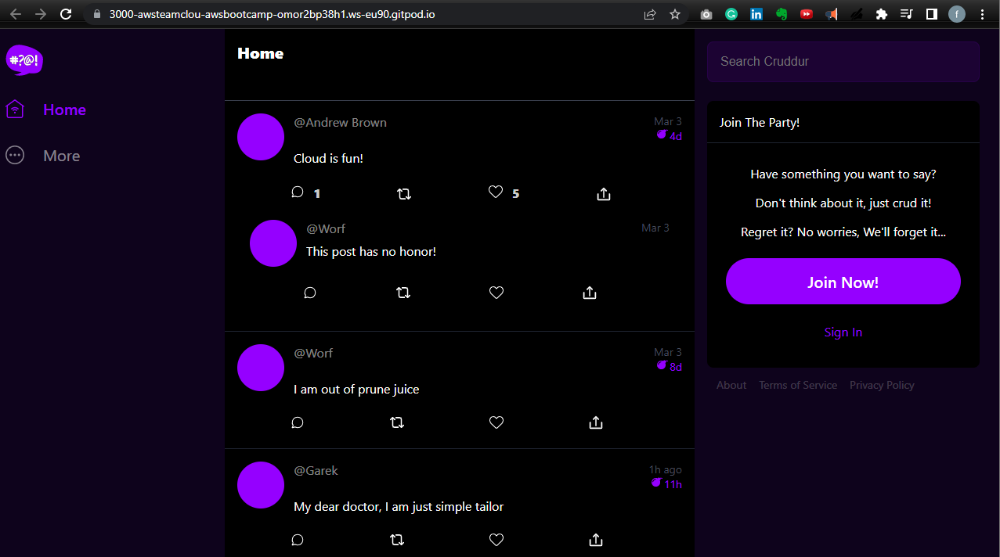
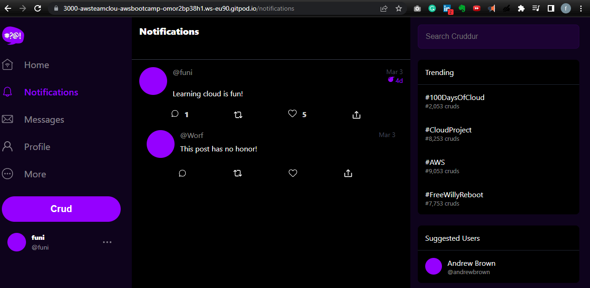

# Week 1 — App Containerization

## Required homework

### Created a Dockerfile into the backend flask folder and pasted the following code

```
FROM python:3.10-slim-buster

#Inside container
#make a new folder inside container
WORKDIR /backend-flask

#Inside container
#install the python images for the app
COPY requirements.txt requirements.txt

#outside container
#Install python libraries fot the app
RUN pip3 install -r requirements.txt

# copies everything in the container
COPY . .

#sets environment variables inside  the container
ENV FLASK_ENV=development

EXPOSE ${PORT}
#python3 -m flask run --host=0.0.0.0 --port=4567 runs backend via flack modules
CMD [ `"python3"`, "-m" , "flask", "run", "--host=0.0.0.0", "--port=4567"] 
```


### I ran the following command to build the backend
```
docker build -t  backend-flask ./backend-flask
```

### I then ran the following command to run the container

After running the command, I got a 404 error, and this showed that the backend was running.


```
docker run --rm -p 4567:4567 -it backend-flask 
```

I changed directories to the Frontend directory and I installed NPM into gitpod using this commands
```
cd frontend-react-js
npm i
```
Then I created another dockerfile in the Frontend-react-js folder, and also pasted this command in the file
```
FROM node:16.18

ENV PORT=3000

COPY . /frontend-react-js
WORKDIR /frontend-react-js
RUN npm install
EXPOSE ${PORT}
CMD ["npm", "start"]
```

I ran the following command to build the containers
```
docker build -t frontend-react-js ./frontend-react-js
```
I ran this command to run the container
```
docker run -p 3000:3000 -d frontend-react-js
```

After running the commands, I could see that the frontend was working, however it was not communicating with the backend. So I ran the following command 
```
version: "3.8"
services:
  backend-flask:
    environment:
      FRONTEND_URL: "https://3000-${GITPOD_WORKSPACE_ID}.${GITPOD_WORKSPACE_CLUSTER_HOST}"
      BACKEND_URL: "https://4567-${GITPOD_WORKSPACE_ID}.${GITPOD_WORKSPACE_CLUSTER_HOST}"
    build: ./backend-flask
    ports:
      - "4567:4567"
    volumes:
      - ./backend-flask:/backend-flask
  frontend-react-js:
    environment:
      REACT_APP_BACKEND_URL: "https://4567-${GITPOD_WORKSPACE_ID}.${GITPOD_WORKSPACE_CLUSTER_HOST}"
    build: ./frontend-react-js
    ports:
      - "3000:3000"
    volumes:
      - ./frontend-react-js:/frontend-react-js

# the name flag is a hack to change the default prepend folder
# name when outputting the image names
networks: 
  internal-network:
    driver: bridge
    name: cruddur
```

### I right clicked on the docker-compose.yml file and clicked on Compose Up. I clicked on the link again and the frontend and backend were connected.




### Implimenting the notifications feature
I created the notifications feature following the [week 1 video](https://www.youtube.com/watch?v=k-_o0cCpksk&list=PLBfufR7vyJJ7k25byhRXJldB5AiwgNnWv&index=27) on how to impliment this


### Adding database 
I ran the following commands to add database locally. The scripts were added inside docker compose file

#### Adding DynamoDB
```
services:
  dynamodb-local:
    # https://stackoverflow.com/questions/67533058/persist-local-dynamodb-data-in-volumes-lack-permission-unable-to-open-databa
    # We needed to add user:root to get this working.
    user: root
    command: "-jar DynamoDBLocal.jar -sharedDb -dbPath ./data"
    image: "amazon/dynamodb-local:latest"
    container_name: dynamodb-local
    ports:
      - "8000:8000"
    volumes:
      - "./docker/dynamodb:/home/dynamodblocal/data"
    working_dir: /home/dynamodblocal
```
#### Adding Progres
```
services:
  db:
    image: postgres:13-alpine
    restart: always
    environment:
      - POSTGRES_USER=postgres
      - POSTGRES_PASSWORD=password
    ports:
      - '5432:5432'
    volumes: 
      - db:/var/lib/postgresql/data
volumes:
  db:
    driver: local
```

#### Ran the following command to install postgres
```
  - name: postgres
    init: |
      curl -fsSL https://www.postgresql.org/media/keys/ACCC4CF8.asc|sudo gpg --dearmor -o /etc/apt/trusted.gpg.d/postgresql.gpg
      echo "deb http://apt.postgresql.org/pub/repos/apt/ `lsb_release -cs`-pgdg main" |sudo tee  /etc/apt/sources.list.d/pgdg.list
      sudo apt update
      sudo apt install -y postgresql-client-13 libpq-dev
```

Installed a postgres extension on github and created a database using the extension. 
